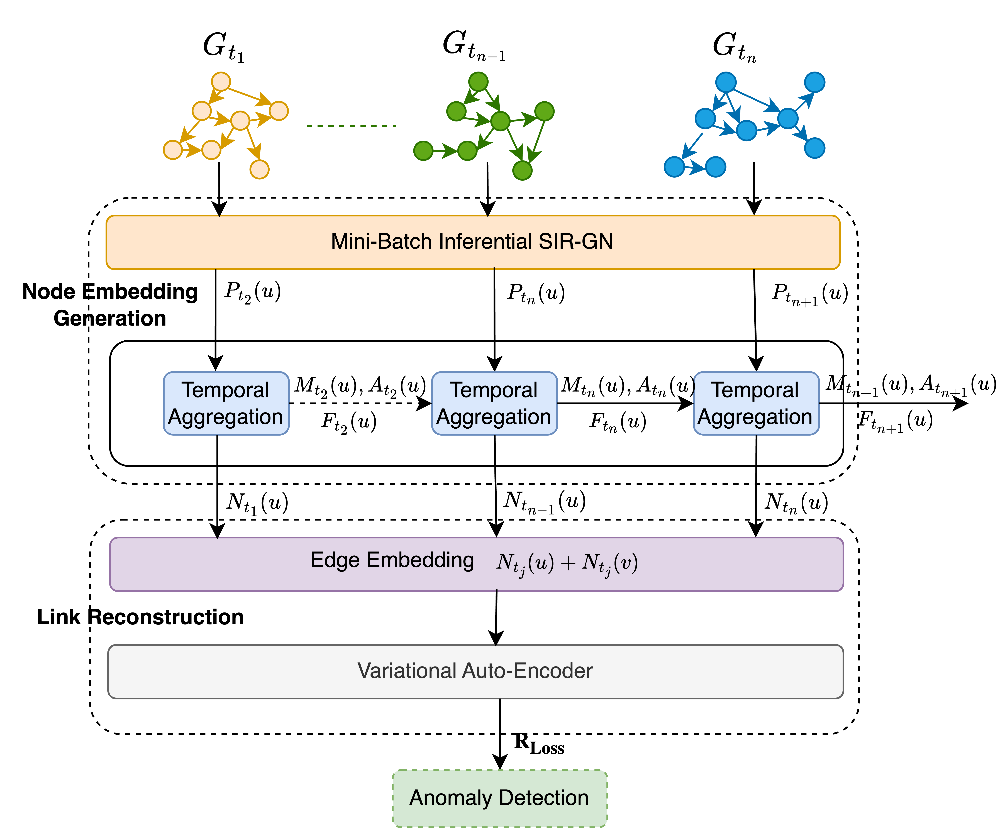

# CAPTOR: Cyber Attacks Prediction using Temporal Online Graph Representation Learning

We devise a novel approach for realtime intrusion detection called **CAPTOR** depicted in the block diagram given below. CAPTOR is an unsupervised algorithm that uses the inferential SIR-GN proposed by Layne et al. and extends it to capture temporal information along with the structural information of the graph. It uses a stream of graphs of the size of $\Omega$ time window and generates unique node embeddings of hosts involved in that window by capturing their structural information. It then uses a novel temporal aggregation method to capture temporal information of nodes distributed across the time windows. The node embeddings are then used to produce edge embeddings by concatenating the node embeddings of hosts associated with the edge. Finally, it uses a Variational Auto-Encoder (VAE) which provides edge reconstruction loss, used as anomaly score to predict benign and malignant events. Three enterprise level datasets comprising network traffic data and authentication data were used to evaluate the model.




## Environment Setup
```
python3 -m venv captor-env
source captor-env/bin/activate
pip install -r requirements.txt
```

## How to run CAPTOR
```
python main.py --train True

```

## Data

